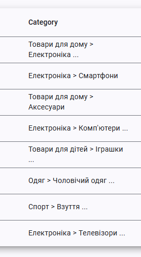
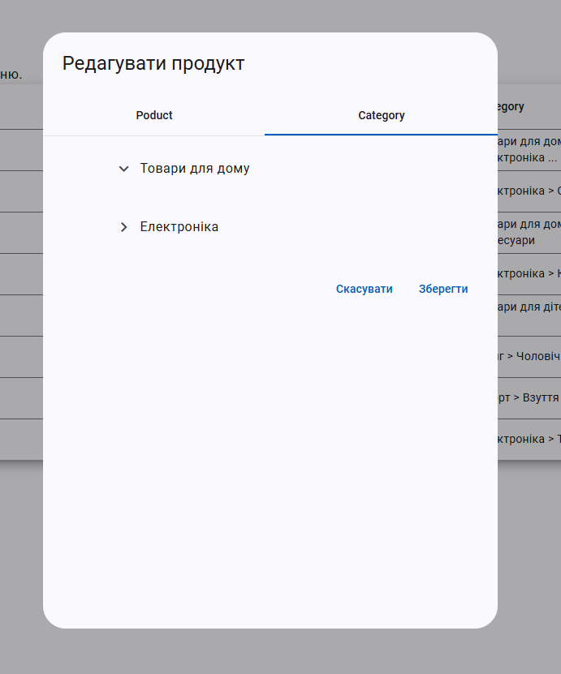

### ЧАСТИНА 3


### **Умови завдання**

1. **Реалізувати принцип CRUD для продуктів**  
   CRUD (Create, Read, Update, Delete) — це набір операцій для роботи з даними:
   - **Create (Створення):** Додавання нового продукту.
   - **Read (Читання):** Отримання списку всіх продуктів.
   - **Update (Оновлення):** Зміна даних продукту.
   - **Delete (Видалення):** Видалення продукту зі списку.

2. **Таблиця продуктів із кнопками керування**
   - Продукти повинні відображатися у вигляді таблиці.
   - Для кожного продукту повинні бути доступні кнопки:
      - **Змінити:** Відкриває форму для редагування полів продукту.
      - **Видалити:** Видаляє продукт після підтвердження.

3. **Додати кнопку "Додати продукт" над таблицею**
   - Кнопка **"Додати продукт"** відкриває форму для введення даних нового продукту.
   - Після додавання новий продукт має з’явитися у таблиці без перезавантаження сторінки.
4. **Після додавання/оновлення продукту. потрібне оновлення таблиці**
  
---

### server

````markdown
# Products API Server

## Описание

Сервер для управления продуктами с поддержкой загрузки изображений.

## Установка

1. Установите зависимости:
   ```bash
   npm install
   ```
````

2. 
3. Запустите сервер:
   ```bash
   node index.js
   ```

## Маршруты

### 1. Получить случайный продукт

`GET /random-product`  
**Ответ:**

```json
{
  "productID": 1,
  "name": "Продукт 1",
  "price": 100,
  "discount": 10,
  "sku": "SKU001",
  "isActive": true,
  "countryCode": "us",
  "tags": ["электроника", "новинка"],
  "imageUrl": "/uploads/1698068457112-123.jpg"
}
```

### 2. Получить все продукты

`GET /all-products`  
**Ответ:**

```json
[
  {
    "productID": 1,
    "name": "Продукт 1",
    "price": 100,
    "discount": 10,
    "sku": "SKU001",
    "isActive": true,
    "countryCode": "us",
    "tags": ["электроника", "новинка"],
    "imageUrl": "/uploads/1698068457112-123.jpg"
  }
]
```

### 3. Добавить продукт с изображением

`POST /products`  
**Тело запроса:**  
Форма следующими полями:

```json
{
  "name": "Новый продукт",
  "price": "200",
  "discount": "10",
  "sku": "SKU021",
  "isActive": "true",
  "countryCode": "us",
  "itemUrl": "https://example.com/new-product",
  "tags": "электроника,новинка"
}
```

**Ответ:**

```json
{
  "productID": 2,
  "name": "Новый продукт",
  "price": 200,
  "imageUrl": "/uploads/1698068457112-456.jpg"
}
```

### 4. Обновить продукт

`PUT /products/:id`  
**Тело запроса:**

```json
{
  "price": 150,
  "isActive": false
}
```

### 5. Удалить продукт

`DELETE /products/:id`

---

## Запуск сервера

Сервер доступен на порту `80`.  
После загрузки изображений они будут доступны по URL:

### **Интерфейсы продуктов**
```
export interface Product {
  productID: number;
  name: string;
  price: number;
  discount: number;
  sku: string;
  isActive: boolean;
  countryCode: string;
  itemUrl: string;
  tags: string[];
  imageUrl: string;
}
````
Частина 4

# Покращення таблиці продуктів та модального вікна редагування

## Опис завдання

У цьому проєкті необхідно:

1. **Додати нову колонку** з категоріями в таблицю продуктів.
2. Оскільки продукт може мати багато категорій, у таблиці потрібно відображати **тільки першу та останню** категорію.
3. Реалізувати **модальне вікно редагування продукту** з двома **табами**:
   - **Таб 1:** Редагування основних параметрів (назва, ціна, знижка).
   - **Таб 2:** Відображення категорій у вигляді **дерева**.
4. **Функціонал додавання нових категорій** буде реалізовано пізніше.

---

## Вимоги

### 1. **Покращення таблиці продуктів**
- Додайте нову колонку **"Категорії"** у таблицю.
- Якщо категорій кілька, відобразіть **першу та останню** категорію у форматі:
  ```  
  Перша категорія > ... > Остання категорія  
  ```
- Якщо категорія одна — відобразіть тільки її.
- При натисканні на рядок таблиці має відкриватися **модальне вікно редагування продукту**.

---

### 2. **Модальне вікно редагування продукту**
- Реалізуйте модальне вікно з **двома табами**:
   1. **Основні параметри** (назва, ціна, знижка).
   2. **Категорії**: Відображення категорій продукту у вигляді **дерева**.
- **Функціонал додавання категорій** буде впроваджено у майбутньому.

---


## План роботи

1. **Оновити таблицю продуктів**:
   - Додати колонку для категорій.
   - Реалізувати логіку для показу лише першої та останньої категорій.

2. **Реалізувати модальне вікно редагування**:
   - Додати таби для основних параметрів та категорій.
   - Побудувати дерево категорій для відображення в табі "Категорії".

---